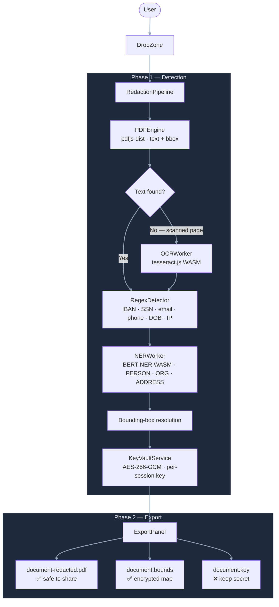

# Bounds — Architecture

## Privacy model

Bounds is built on a single, non-negotiable constraint: **no personal data ever leaves the user's device**.

This is not a setting or a policy, it is enforced by the architecture. There is no server to send data to. All AI inference, PDF processing, OCR, and cryptography run inside the browser using WebAssembly. The privacy guarantee is verifiable: open DevTools → Network tab and watch. Zero outbound requests after the initial page load.

This means Bounds never trains on your documents, never logs your data, and requires no account or trust relationship with any third party.

---

## High-level overview



---

## Pipeline in detail

### Phase 1 — Detection

`runDetection` in `src/pipeline/RedactionPipeline.ts` orchestrates the following steps:

1. **Text extraction** (`PDFEngine`) — `pdfjs-dist` extracts text spans with bounding box coordinates (x, y, width, height in PDF user-space units) for every page.

2. **OCR fallback** (`OCRWorker`) — If a page has no extractable text (scanned or image-only), `tesseract.js` renders the page to a canvas blob and performs OCR locally. Language is passed through from the user's selection.

3. **Regex detection** (`RegexDetector`) — Structured PII patterns (IBAN, SSN, email, phone number, passport, date of birth, IP address, credit card) are matched using locale-aware regular expressions. These run synchronously and are fast.

4. **NER detection** (`NERWorker`) — A quantised multilingual BERT model (`Xenova/bert-base-multilingual-cased-ner-hrl`, ~430 MB ONNX, cached in IndexedDB after first load) runs in a Web Worker via `@xenova/transformers`. Returns entity spans (PERSON, ORG, ADDRESS, MISC) with confidence scores. Deduplicates against regex detections to avoid double-tagging.

5. **Bounding box resolution** — Each detection's text span is matched back to its PDF coordinates so redaction boxes can be drawn precisely.

6. **Encryption** (`KeyVaultService`) — A fresh AES-256-GCM key is generated per session using the browser's built-in `crypto.subtle` API. The full redaction map (token → original value) is encrypted and written to a `.bounds` file. The raw key bytes are written to a `.key` file. The `.bounds` file contains only ciphertext — it is cryptographically useless without the `.key` file.

### Phase 2 — Export

`buildRedactedPdf` applies the user's finalised detection list (they may have toggled individual detections off in the review step) and redaction options (box colour, label style, optional watermark) using `pdf-lib`. Solid boxes are painted over each bounding box. The original PDF structure is preserved — only the visual layer is modified.

---

## Reversible redaction

After redacting, the user downloads three files:

| File | Contents | Safe to share? |
|---|---|---|
| `document-redacted.pdf` | Original PDF with PII replaced by solid boxes | ✅ Yes |
| `document.bounds` | AES-256-GCM encrypted redaction map (IV + ciphertext + plaintext summary of counts only) | ✅ Yes (useless without `.key`) |
| `document.key` | Raw 32-byte AES key | ❌ Keep secret |

To restore the original: drag all three files back into Bounds. The `.bounds` and `.key` files are both required — neither is sufficient alone.

The `.bounds` file exposes only non-sensitive metadata in plaintext (filename, timestamp, count of redacted items by type — never the original values).

---

## Detection types

| Type | Source | Notes |
|---|---|---|
| `PERSON` | NER | Names — first, last, full |
| `ORG` | NER | Organisations, companies |
| `ADDRESS` | NER | Street addresses |
| `MISC` | NER | Other identified entities |
| `EMAIL` | Regex | RFC-aware pattern |
| `PHONE` | Regex | International formats |
| `IBAN` | Regex | All EU/CH country codes |
| `CREDIT_CARD` | Regex | Luhn-validated |
| `SSN` | Regex | US SSN + EU equivalents |
| `PASSPORT` | Regex | ICAO-format passport numbers |
| `ID_NUMBER` | Regex | National ID formats |
| `DATE_OF_BIRTH` | Regex | Common date formats |
| `IP_ADDRESS` | Regex | IPv4 and IPv6 |

---

## Supported languages

English · German · French · Italian · Spanish

Language selection affects: OCR engine language pack, regex locale rules, and the NER model (multilingual BERT handles all five natively).

---

## Deployment / self-hosting

Bounds produces a fully static build (`dist/`) with no server-side component. Any static file host works.

The only server-side requirement is two HTTP headers required for `SharedArrayBuffer` (used by Tesseract.js and Transformers.js WASM threading):

```
Cross-Origin-Opener-Policy: same-origin
Cross-Origin-Embedder-Policy: require-corp
```

These are already configured in `vercel.json` for Vercel deployments and in `vite.config.ts` for the dev server. For other hosts (nginx, Apache, Cloudflare Pages) the same headers must be added manually.

There is no database, no backend, and no environment variables. The entire application is self-contained in the `dist/` directory.

---

## PWA

`vite-plugin-pwa` (Workbox-based) is installed. When configured, it will:

- Register a service worker that pre-caches the app shell and static assets
- Cache the ONNX model files and WASM binaries in IndexedDB/Cache Storage after the first load
- Enable full offline use after the initial visit
- Make Bounds installable as a native-feeling app on desktop and mobile

Service worker registration and Web App Manifest are not yet wired into `vite.config.ts` — this is in progress.

---

## Key dependencies

| Component | Library | Version | Licence |
|---|---|---|---|
| Multilingual NER (WASM) | `@xenova/transformers` | ^2.17.1 | Apache 2.0 |
| PDF text extraction + bbox | `pdfjs-dist` | ^4.3.136 | Apache 2.0 |
| PDF redaction rendering | `pdf-lib` | ^1.17.1 | MIT |
| OCR (scanned pages) | `tesseract.js` | ^5.1.0 | Apache 2.0 |
| Cryptography | Web Crypto API (built-in) | — | — |
| UI | React 18 + Tailwind CSS | ^18.3.1 / ^3.4.4 | MIT |
| Build | Vite + TypeScript | ^5.3.1 / ^5.5.3 | MIT |

---

## Source layout

```
src/
├── pipeline/
│   ├── RedactionPipeline.ts   — orchestrator (Phase 1 + Phase 2)
│   ├── PDFEngine.ts           — pdfjs-dist extraction, pdf-lib rendering
│   ├── RegexDetector.ts       — locale-aware structured PII patterns
│   ├── NERWorker.ts           — BERT NER bridge to Web Worker
│   ├── OCRWorker.ts           — tesseract.js bridge to Web Worker
│   └── KeyVaultService.ts     — AES-256-GCM encrypt/decrypt vault
├── workers/
│   ├── ner.worker.ts          — Web Worker: @xenova/transformers inference
│   ├── ocr.worker.ts          — Web Worker: tesseract.js WASM
│   └── explain.worker.ts      — Web Worker: privacy summary generation
├── components/
│   ├── DropZone.tsx
│   ├── LoadingOverlay.tsx
│   ├── RedactionReview.tsx
│   ├── ExportPanel.tsx
│   └── ...
├── types/index.ts             — Detection, RedactionMap, PipelineStep, etc.
├── i18n/                      — UI strings (en, de, fr, it, es)
└── utils/
    ├── fileUtils.ts
    └── colors.ts
```

---

*Built by Anya Chueayen · Aqta Technologies Ltd · MIT Licence*
