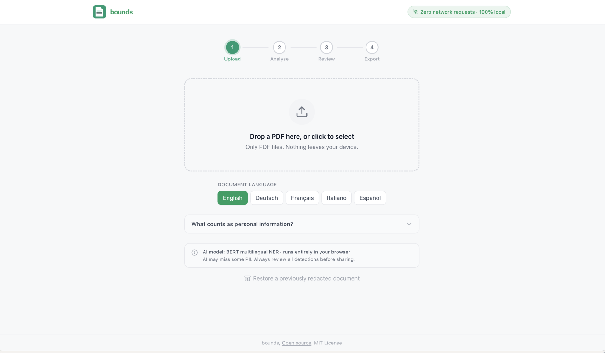

# bounds 🔒

[](https://www.youtube.com/watch?v=XHLaRmNPfCs)
[](https://bounds.aqta.ai)

[](https://huggingface.co/Xenova/bert-base-NER)
[](https://mozilla.github.io/pdf.js/)
[](https://developer.mozilla.org/en-US/docs/Web/API/SubtleCrypto)

**Privacy-first PDF redaction using hybrid AI. Zero uploads. Reversible encryption.**

Mishandling a single medical PDF can expose you to GDPR fines up to €20M. Bounds redacts entirely in your browser, your file never transits a vendor server.

---

## Try It Now (2 Minutes) ⚡

1. Open [bounds.aqta.ai](https://bounds.aqta.ai)
2. Open DevTools → Network tab
3. Upload any PDF with personal information
4. Watch: Zero network requests after initial load
5. Review AI-detected PII + generative risk summary
6. Export redacted PDF + encrypted vault + key
7. Restore: Drag all three files back to see reversible redaction

---

## What It Does ✨

- 🧠 **Hybrid AI detection** — BERT NER + Flan-T5 generative AI, all local
- 🌍 **Multilingual** — EN, DE, FR, IT, ES documents
- 🔄 **Reversible redaction** — AES-256-GCM vault, restore original any time
- ✈️ **Works in airplane mode** — Fully offline after first use
- 🏥 **Healthcare-ready** — GDPR/HIPAA compliant by design
- 📋 **Audit trail** — Timestamped JSON log (no document content)



---

## Reversible Redaction 🔄 

Traditional redaction is destructive. Bounds encrypts the redaction map with AES-256-GCM.

After redacting, you download **four files**:

| File | Description |
|---|---|
| `document-redacted.pdf` | Safe to share — PII replaced with black boxes |
| `document.bounds` | Encrypted map of what was redacted |
| `document.key` | AES decryption key — **keep this secret** |
| `document-audit.json` | Timestamped audit log (no document content) |

To restore: drag the redacted PDF, `.bounds`, and `.key` back into Bounds.

**Why it matters:** Legal discovery, clinical audits, and compliance reviews need the original. Traditional tools force you to keep two copies with no access control. Bounds gives you one redacted copy + encrypted restore path.

---

## GenAI Integration 🤖 

Bounds is a privacy-enabling layer for safe GenAI workflows. You cannot safely send unredacted documents to external LLMs without violating GDPR/HIPAA.


**Generative AI components:**
1. **BERT NER** (430MB) — Discriminative AI for PII detection
2. **LaMini-Flan-T5-77M** (77MB) — Generative AI for risk summaries
   - Produces: "This document contains sensitive medical information including 3 patient names, 2 addresses, and 1 social security number"
   - See: `src/workers/explain.worker.ts`

---

## Privacy by Design 🛡️

Open DevTools → Network tab. You'll see **zero outbound requests** after the initial page load. All AI inference, PDF processing, and cryptography happen locally using WASM.

Bounds deliberately has no external LLM integration. The moment a document is routed through an external model, your data becomes training material. Local BERT inference delivers ≥90% PII recall without any of that.

---

## Supported PII Types 🔍 

**Universal (all languages):**
- `PERSON` — Full names (NER)
- `ORG` — Companies, institutions (NER)
- `ADDRESS` — Street addresses (NER + locale postcode)
- `EMAIL`, `PHONE`, `IBAN`, `CREDIT_CARD`, `IP_ADDRESS`, `DATE_OF_BIRTH`

**Locale-specific:**
- 🇬🇧 UK National Insurance, UK postcode
- 🇺🇸 US Social Security Number
- 🇩🇪 Sozialversicherungsnummer, Steueridentifikationsnummer
- 🇨🇭 Swiss AHV / AVS number
- 🇫🇷 Numéro INSEE (NIR)
- 🇮🇹 Codice Fiscale, Partita IVA
- 🇪🇸 DNI / NIE, Número de Seguridad Social
- All: ICAO passport numbers

---

## Setup 🚀

```bash
cd bounds
npm install
npm run dev
# → http://localhost:5173
```

On first PDF load, the BERT NER model (~430 MB) downloads and caches in IndexedDB. Subsequent runs are instant.

## Build & Test

```bash
npm run build       # Production build → dist/
npm test            # 176 unit tests, 100% pass rate
npm run preview     # Preview production build
```

---

## Tech Stack ⚡

| Component | Library |
|---|---|
| **AI Models** | `@xenova/transformers` (BERT NER + Flan-T5) |
| **PDF Processing** | `pdfjs-dist`, `pdf-lib`, `tesseract.js` |
| **Security** | Web Crypto API (AES-256-GCM) |
| **UI** | React 18 + Tailwind CSS |

All MIT/Apache 2.0 licensed.

---

## Architecture 🏗️

See [architecture.png](architecture.png) or [ARCHITECTURE.md](ARCHITECTURE.md) for details.

```
Browser (local only)
│
├── React UI (4-step wizard)
├── RedactionPipeline (orchestrator)
│   ├── PDFEngine (pdfjs-dist + pdf-lib)
│   ├── RegexDetector (locale-aware patterns)
│   ├── NERWorker (BERT in Web Worker)
│   ├── OCRWorker (tesseract.js for scanned pages)
│   └── KeyVaultService (AES-256-GCM)
│
└── No network calls after initial load
```

---

## Self-Hosting 🏠

Bounds is fully static. Serve `dist/` from any host with these headers:

```
Cross-Origin-Opener-Policy: same-origin
Cross-Origin-Embedder-Policy: require-corp
```

Works on Vercel, Cloudflare Pages, Nginx, Apache, Docker. No database or backend required.

---

## Contributing 🤝

See [CONTRIBUTING.md](CONTRIBUTING.md) for guidelines.

---

## Acknowledgements 🙏

Built for **GenAI Zürich Hackathon 2026** · **GoCalma Challenge**

Thanks to the GenAI Zurich community and GoCalma for inspiring privacy-first innovation.

---

*bounds is an open-source project by Anya Chueayen, Aqta Technologies Ltd · MIT Licence*
