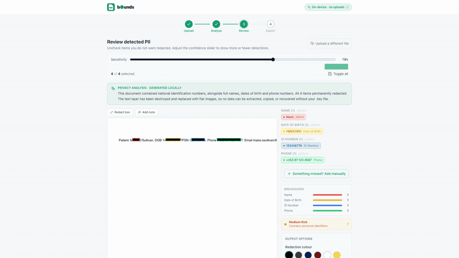
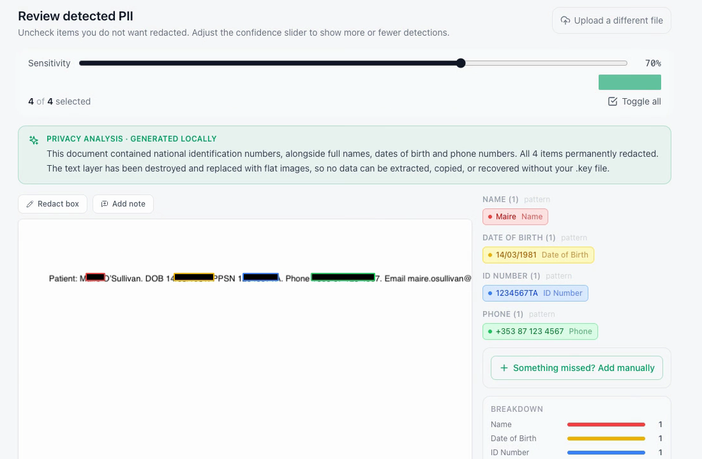
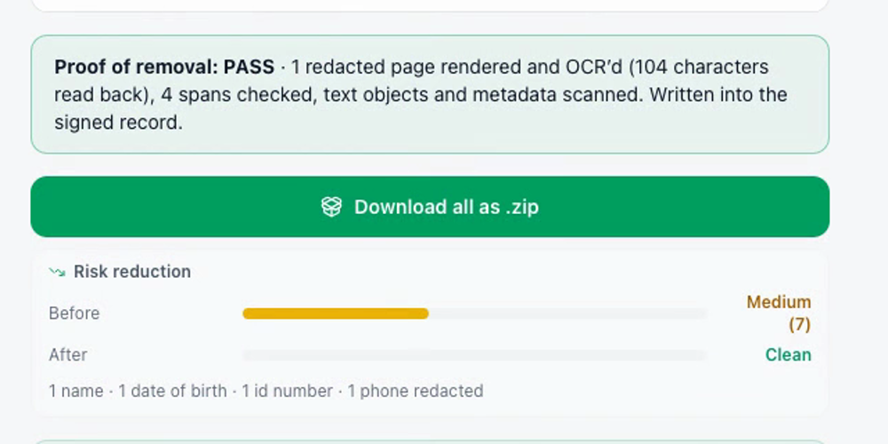
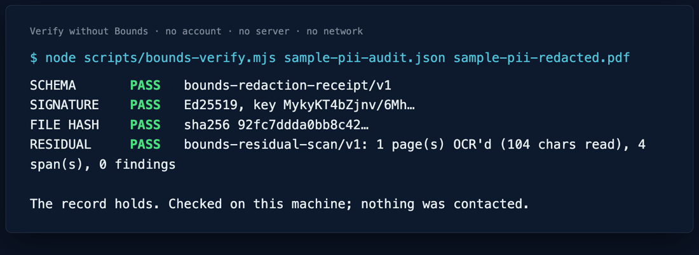

# bounds

[](https://bounds.aqta.ai/)
[](https://www.npmjs.com/package/bounds-gemma)
[](https://www.npmjs.com/package/bounds-gemma)

**Most redaction tools ask you to trust that the information was removed. Bounds produces a signed record that lets someone else verify that it was.**

Detection runs on your device, including contextual PHI detection with Gemma 4, so the document never has to leave the machine that opened it. After redaction, Bounds scans the output file itself, signs the result, and anyone can check the record and the file offline with a ninety-line script.

```text
document ──► regex · BERT NER · OCR · faces · Gemma 4 (local Ollama) ──► candidate spans
                                                                            │  in-corpus guardrail, confidence threshold, human review
                                                                            ▼
                                                                    rasterised PDF
                                                                            │
                                            residual text scan · PDF object scan · rendered OCR scan · metadata scan
                                                                            │
                                                                            ▼
                                                    verification block ──► Ed25519 signature ──► bounds-verify, offline
```

**Precisely:** layers 1 to 4 run in the browser; the Gemma 4 pass runs through a local Ollama daemon and is absent without one. Nothing in the redaction path contacts a server.

Bounds finds and redacts personal information in PDFs using on-device AI. No server, no account, no document content leaves your machine. Works offline once your language packs are downloaded.

> **Now with Gemma 4 contextual PHI.** Bounds ships a fifth detection layer powered by Google's Gemma 4 E2B. It catches the protected-health-information shapes that regex and named-entity recognition systematically miss: inline diagnoses, medication mentions, treatment narratives, indirect health context, sensitive social data, and genetic references. The HIPAA Safe Harbor #17 catch-all gap, closed without sending document bytes anywhere. Preferred path: local Ollama (`gemma4:e2b`). An in-browser WebLLM path is wired for `gemma-4-E2B-it-q4f16_1-MLC` and activates when that MLC build is available; until then, without Ollama the other four layers run alone (no silent fallback to older Gemma).
>
> The Gemma 4 pipeline is published as a standalone Apache-2.0 package, [bounds-gemma on npm](https://www.npmjs.com/package/bounds-gemma). Install it with `npm i bounds-gemma` and run the same contextual PHI detection against your own pipelines. It runs through a local Ollama daemon; nothing is sent to a server.




*Twelve seconds of the live app: detections, redaction, then the output file is scanned and the result signed into the record. Recorded on bounds.aqta.ai, nothing staged.*

---

## Features

- **Five detection layers**: regex patterns (~99% on known patterns), BERT NER (10 trained languages with cross-lingual transfer across mBERT's 104-language pretraining corpus), Tesseract OCR (100% word accuracy on clean printed, 97.6% on noisy rotated/JPEG-compressed scans), face detection, **and Gemma 4 contextual PHI (measured in [`eval/`](eval/): span recall 0.97, precision 0.78 on a labelled synthetic set in English, French and German; precision is enforced by the in-corpus substring guardrail, so surviving spans are byte-identical to the source text)**
- **Gemma 4, Ollama-first**: contextual layer uses `gemma4:e2b` on a local Ollama daemon when available. WebLLM (`gemma-4-E2B-it-q4f16_1-MLC`) is wired and turns on when the MLC build is published; until then, without Ollama the other four layers run alone. No silent substitute of older Gemma.
- **Reversible redaction**: AES-256-GCM encrypted vault lets you restore original values with a key file
- **Works offline**: layers 1-4 (regex / BERT / OCR / faces) run in-browser via WebAssembly + WebGPU; the Gemma 4 layer runs on a local Ollama daemon. Airplane mode after the first load and an `ollama pull`.
- **Batch processing**: drop multiple PDFs at once
- **Audit trail**: timestamped JSON log with no document content
- **Multilingual UI**: EN, DE, FR, ES, IT, PT, NL, PL, GA, TH
- **Chrome extension**: redact from the browser toolbar

---

## Why Gemma 4

The HIPAA Safe Harbor de-identification standard lists eighteen identifier categories. The first sixteen are structured (phone numbers, social-security numbers, medical-record numbers, dates of birth), and regex + NER handle them well. Identifier #17 is *"any other unique identifying number, characteristic, or code"*, and the surrounding clinical narrative is where it lives: a sentence that names a diagnosis without a label, a paragraph that mentions a medication in passing, an aside about a "therapist" or "insulin pump" that re-identifies the patient.

Bounds uses Gemma 4 E2B (effective 2B-active parameter, int4 quantised, ~1.5 GB on disk) as the contextual layer over the other four detectors. Three guardrails make it safe for healthcare:

1. **In-corpus verification**: every Gemma-emitted span must be a byte-identical substring of the page text after Unicode NFC normalisation. Model hallucinations and paraphrases are dropped silently.
2. **Confidence floor of 0.75**: tuned for healthcare; below this, candidates are omitted before reaching the review panel.
3. **Default-off in the review UI**: every Gemma detection arrives with `enabled: false`. The reviewer opts in per item.

Document text never leaves your device. The contextual layer routes through your local Ollama daemon at `localhost:11434` when one is present. Without Ollama, the other four layers run alone until an MLC WebLLM build of Gemma 4 is available; the in-browser path is already wired for `gemma-4-E2B-it-q4f16_1-MLC` (one-time ~1.5 GB download, cached in IndexedDB after).

For the architecture in detail, the [bounds-gemma package](https://www.npmjs.com/package/bounds-gemma) ships the worker, the parser and the system prompt with source maps. The toolkit's source repository, with its tests and a runnable Ollama smoke-test example, is private for now and shared on request.

---

## Quick Start

```bash
npm install
npm run dev
```

On first use, the BERT NER model (~179 MB) downloads once and caches in the browser. The Gemma 4 contextual layer requires a local Ollama daemon with `ollama pull gemma4:e2b` (~7 GB); without it the other four layers run alone. Subsequent runs are instant.

```bash
npm run build       # Production build
npm test            # Unit tests
npm run preview     # Preview production build
```

---

## How It Works

1. **Upload** a PDF (or drop multiple)
2. **Review** AI-detected PII: names, addresses, emails, IBANs, dates of birth, health data, and more. Gemma 4's contextual detections appear with their reason text and default-off, ready for you to opt in per item.

   

3. **Export** four files:

| File | Purpose |
|---|---|
| `*-redacted.pdf` | Safe to share: PII permanently replaced with flat images |
| `*.bounds` | Encrypted redaction map |
| `*.key` | AES decryption key: keep this secret |
| `*-audit.json` | Signed redaction record: what was removed, the SHA-256 of the redacted PDF, and the result of the proof-of-removal scan, under an Ed25519 signature |

To restore original values, drag the `.bounds` and `.key` files into the Restore panel.

### Proof of removal

A redaction that merely looks redacted is the classic failure in this category: a black box drawn
over text that a copy-paste recovers. Bounds rasterises every page that carried a detection, so
the text layer is gone by construction. A claim is not a check, so before the record is signed
Bounds scans the **output file itself**:

| Check | What it does |
|---|---|
| `residual_text_scan` | Extracts the text of every output page and confirms none of the redacted strings, and none of the redacted categories, can be found in it |
| `pdf_object_scan` | Confirms pages that carried detections expose no text objects at all |
| `rendered_ocr_scan` | Renders each redacted page to an image, runs OCR on it, and confirms none of the redacted strings can be read back, and that no OCR word touching a box's edge is a leading or trailing fragment of the span the box was meant to cover (a lone "M" beside a box that covers "aire") |
| `metadata_scan` | Confirms the document metadata (title, author, subject, keywords, producer, creator) carries none of the redacted strings |

The result is written into the signed record as a `verification` block, PASS or FAIL per check,
with a count of findings. Findings name the category and the page, never the text. A record
without the block, or with a FAIL in it, says so; the scan is never omitted to look cleaner.
Spans shorter than six characters once normalised are not searched for in OCR output (a year or
an initial would match unrelated text) but are still held to the exact-text and metadata scans.

Boxes are placed from per-glyph positions measured with the page's own font, not from an
average character width; an earlier build drifted on proportional fonts and could leave the
first or last glyph of a span standing, which the whole-span search above could not see. The
fragment check exists so that class of failure now fails the record instead of passing it.



### Verify without Bounds

Anyone holding the record and the redacted PDF can check both with no Bounds account, no Bounds
server and no network:

```bash
node scripts/bounds-verify.mjs record.json redacted.pdf
```

```text
SCHEMA       PASS   bounds-redaction-receipt/v1
SIGNATURE    PASS   Ed25519, key 3kq9…
FILE HASH    PASS   sha256 7d8f…
RESIDUAL     PASS   bounds-residual-scan/v2: 2 page(s) OCR'd, 9 span(s), 0 findings
```



The verifier is ninety lines of Node with one dependency (`tweetnacl`). It checks the signature
over the canonical JSON of the record, the fingerprint against the embedded key, the SHA-256 of
the PDF against the record, and that every scan in the `verification` block is PASS. Change one
field of the record, or one byte of the PDF, and it says so. `npm run verify -- record.json
redacted.pdf` does the same from the repo.

---

## Self-Hosting

Bounds is fully static. Serve `dist/` from any host with these headers:

```
Cross-Origin-Opener-Policy: same-origin
Cross-Origin-Embedder-Policy: credentialless
```

Works on Vercel, Cloudflare Pages, Nginx, Docker. No backend required. Layers 1-4 use WebGPU + cross-origin isolation in the browser; the Gemma 4 contextual layer uses Ollama when present. The WebLLM path requires an MLC Gemma 4 build and COOP/COEP; until that build is published, absence of Ollama means layers 1-4 only.

---

## Technology, and where the privacy boundary sits

**Google.** Gemma 4 E2B (through the standalone `bounds-gemma` package) finds the contextual PHI that regex and NER miss: inline diagnoses, medications in prose, treatments, indirect health context, sensitive social context, genetic references. Gemma proposes spans with a category and a confidence; the deterministic engine decides and removes; Gemma never touches the PDF.

**NVIDIA.** Ollama uses an NVIDIA GPU for the Gemma pass when one is present (CUDA on Linux and Windows; Apple silicon otherwise). The evaluation harness in [`eval/`](eval/) runs the shipped prompt and acceptance rules against a labelled synthetic set and reports span-level recall and precision per category; results are recorded in [`eval/results/`](eval/results/) with the hardware they ran on, and nothing is claimed for hardware it has not run on. The current result is from Apple silicon; a notebook for a Google Colab T4 run is in the same folder and its result will be committed when it has been run.

**The boundary.** Document bytes never leave the machine as part of redaction. Evaluation uses synthetic narratives only, never real documents. The four residual checks and the signature are computed locally; the verifier needs no network.

## Related projects

- **[bounds-gemma on npm](https://www.npmjs.com/package/bounds-gemma)**: the Gemma 4 contextual PHI pipeline as a standalone Apache-2.0 package. Worker, parser, system prompt. `npm i bounds-gemma`. Source repository private for now, shared on request.

---

## Contributing

See [CONTRIBUTING.md](CONTRIBUTING.md).

---

## Licence

The source code is licensed under the [Apache-2.0 Licence](LICENSE). See [NOTICE](NOTICE) for third-party attributions (Google Gemma 4, HIPAA Safe Harbor categories).

"Bounds" is a trademark of Aqta Technologies Ltd and is not covered by the Apache-2.0 Licence. You may fork and modify the code, but you may not use the Bounds name or logo to market a derivative product.
